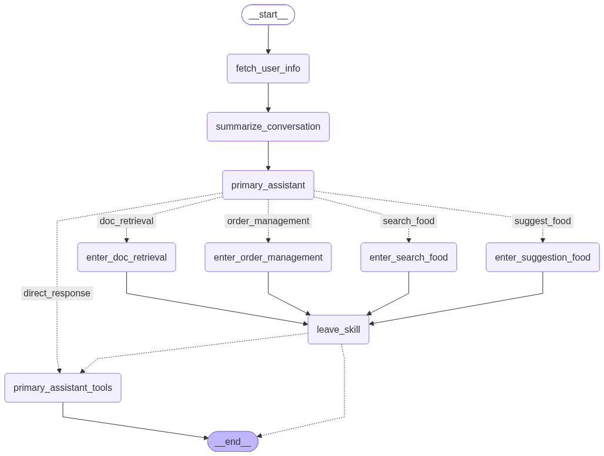
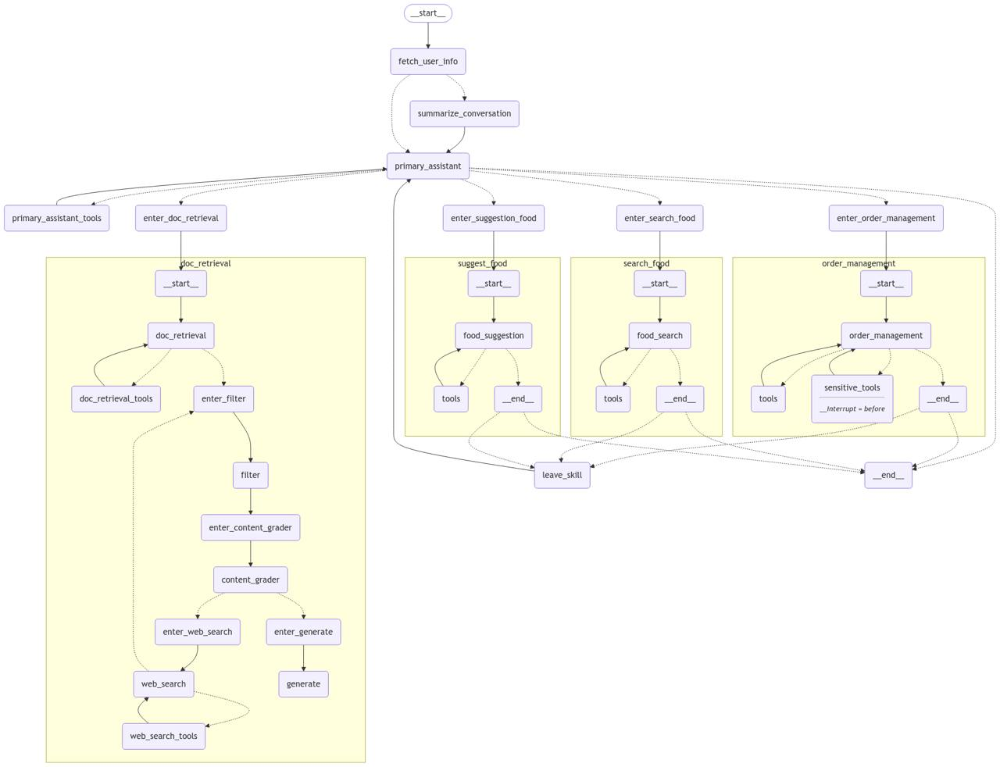
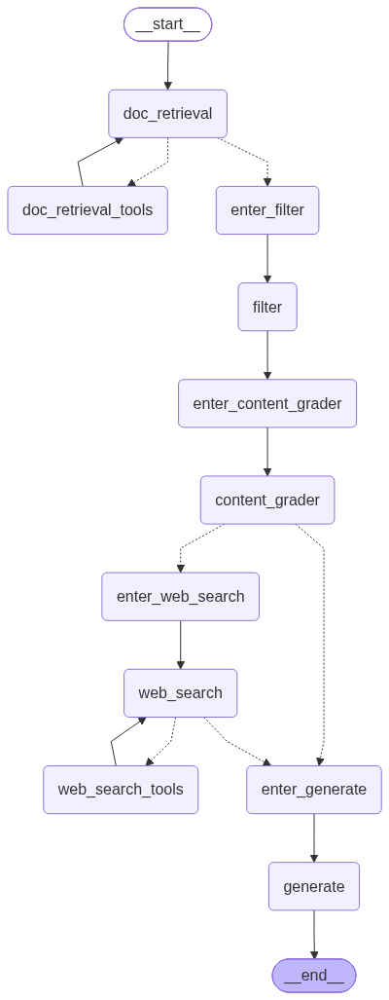
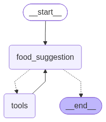
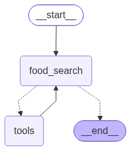
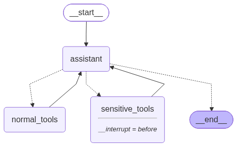

# ChatFood: An Agentic Food Ordering Assistant

<p align="center">
  <strong>LLM-powered multi-agent food assistant built with LangGraph, RAG, LanceDB, SQLite, and Chainlit.</strong>
</p>

---

## 📌 Overview

**ChatFood** is an LLM-powered agentic food assistant built with **LangGraph**.

Instead of relying on a single chatbot workflow, ChatFood uses a **supervisor-based architecture** that analyzes each user request and routes it to a specialized workflow.

The system can:

* 📖 Answer general and food-related questions using **RAG**
* 🍽️ Recommend food based on user preferences
* 🔍 Search restaurant menus and available food items
* 📦 Check and manage orders
* ❌ Handle order cancellation with **Human-in-the-Loop confirmation**
* 💬 Maintain conversational state and summarize longer conversations
* 📊 Display token usage and the executed graph path through the Chainlit interface

The project demonstrates practical patterns for building **stateful, tool-using, multi-agent LLM applications** with LangGraph.

---

## ✨ Key Features

### 🧠 LLM-Based Routing

A central supervisor analyzes the user's request and selects the appropriate workflow using **structured output with Pydantic**.

The current routing paths are:

```text
direct_response
doc_retrieval
suggest_food
search_food
order_management
```

This allows each capability to remain modular and independently implemented.

---

### 📚 RAG with Relevance Grading & Web Fallback

For food-related knowledge questions, ChatFood uses a document retrieval pipeline.

The workflow is:

```text
User Question
      │
      ▼
Document Retrieval
      │
      ▼
Relevance Grading
      │
 ┌────┴─────┐
 │          │
Relevant   Not Relevant
 │          │
 ▼          ▼
Generate   DuckDuckGo
Answer     Web Search
               │
               ▼
          Generate Answer
```

The RAG pipeline includes:

* 📄 PDF document parsing
* ✂️ Recursive text chunking
* 🧠 Local **BGE-small-en-v1.5** embeddings
* 🗄️ **LanceDB** vector storage
* 🔎 Semantic retrieval
* ⚖️ LLM-based document relevance grading
* 🌐 **DuckDuckGo** web-search fallback
* ✍️ Context-grounded response generation

If the retrieved documents are not considered relevant to the user's question, the system automatically triggers a web-search workflow using DuckDuckGo.

> **Note:** The retrieval pipeline is better described as **RAG with relevance grading and web-search fallback**, rather than a traditional hybrid BM25 + vector retrieval system.

---

### 🍽️ Food Recommendation

The recommendation workflow analyzes natural-language user preferences and generates suitable food suggestions.

Example:

```text
"I want something spicy and fast-food."
```

The system can reason over the user's requirements and identify appropriate food options from the available restaurant data.

---

### 🔍 Natural-Language Food Search

Users can search for food items using natural language.

Examples:

```text
Which restaurants serve Ghormeh Sabzi?

Do you have burgers?

How much is a Pepperoni Pizza?

Find a spicy pizza.
```

The food search workflow uses database-backed search together with **fuzzy matching** to make food discovery more flexible.

---

### 📦 Order Management

ChatFood includes a SQLite-backed order management workflow.

Users can:

* Check order status
* View order information
* Cancel orders
* Leave reviews
* Interact with the order workflow through natural language

The application also verifies the user before accessing order-related functionality.

---

### 🛡️ Human-in-the-Loop Order Cancellation

Order cancellation is treated as a sensitive action.

Instead of immediately executing the cancellation, the system asks the user for explicit confirmation.

```text
User
 │
 ▼
Cancel Order
 │
 ▼
Confirmation Required
 │
 ├──────────────┐
 │              │
 ▼              ▼
 YES            NO
 │              │
 ▼              ▼
Cancel Order   Abort
```

This workflow is implemented directly in the Chainlit application and integrated with the order-management subgraph.

---

### 🧠 Conversation Memory & Summarization

ChatFood maintains conversational state using **LangGraph's state and checkpointing mechanisms**.

When a conversation becomes sufficiently long, older messages are summarized and removed from the active message history.

This helps:

* Reduce unnecessary context
* Control token usage
* Preserve important conversation details
* Maintain relevant user preferences across longer interactions

The supervisor state includes conversation messages, user information, summary information, the current skill, and the executed graph path.

---

### 📊 Token Usage & Execution Path

The Chainlit interface displays information about the LLM execution, including:

* Total token usage
* Input tokens
* Output tokens
* Graph execution path

For example:

```text
Graph Execution Route:

fetch_user_info
      ↓
summarize_conversation
      ↓
primary_assistant
      ↓
doc_retrieval
      ↓
generate
```

This provides basic visibility into how a request moves through the agentic workflow.

---

# 🏗️ Architecture

ChatFood follows a **supervisor-based multi-agent architecture**.

At a high level:

```text
                         ┌──────────────┐
                         │     User     │
                         └──────┬───────┘
                                │
                                ▼
                    ┌─────────────────────┐
                    │   Primary Router    │
                    │  Structured Output  │
                    └──────────┬──────────┘
                               │
        ┌────────────┬─────────┼──────────┬───────────────┐
        │            │         │          │               │
        ▼            ▼         ▼          ▼               ▼
     Direct       Document   Recommend   Food Search    Order
    Response     Retrieval     Food                       Management
                      │
                      ▼
                  LanceDB
                      │
                      ▼
               Relevance Grader
                  │       │
              Relevant   Not Relevant
                  │       │
                  │       ▼
                  │   DuckDuckGo
                  │       │
                  └───┬───┘
                      ▼
                   Generate
```

The main supervisor graph connects four specialized workflows:

* **Document Retrieval Agent**
* **Food Recommendation Agent**
* **Food Search Agent**
* **Order Management Agent**

along with a direct-response route.

---

## 🧩 Agent Workflows

### Document Retrieval Agent

Responsible for answering food and nutrition-related questions.

```text
Question
   ↓
LanceDB Retrieval
   ↓
Content Relevance Grading
   ↓
 ┌───────────────┐
 │               │
Relevant      Not Relevant
 │               │
 ▼               ▼
Generate      DuckDuckGo
Answer        Search
                  │
                  ▼
               Generate
```

Implemented in:

```text
agents/doc_retrieval.py
```

The workflow uses LanceDB retrieval, an LLM-based content grader, and DuckDuckGo search as the fallback mechanism.

---

### Food Recommendation Agent

Responsible for analyzing food preferences and generating suitable recommendations.

```text
User Preferences
       ↓
Recommendation Workflow
       ↓
Available Food Data
       ↓
Recommended Options
```

Implemented in:

```text
agents/suggest_food.py
```

---

### Food Search Agent

Responsible for finding available food items and restaurant information.

```text
Natural Language Query
          ↓
     Search Workflow
          ↓
    Fuzzy Matching
          ↓
    Food / Restaurant
        Results
```

Implemented in:

```text
agents/search_food.py
```

---

### Order Management Agent

Responsible for order-related operations such as status checks, cancellation, and reviews.

```text
User Request
     ↓
Authentication
     ↓
Order Management
     ↓
SQLite Database
```

Implemented in:

```text
agents/order_management.py
```

---

# 🖼️ Workflow Visualizations

The repository includes visualizations of the main LangGraph workflows.

### Overall Supervisor Graph



### Final Workflow



### Document Retrieval Workflow



### Food Recommendation Workflow



### Food Search Workflow



### Order Management Workflow



---

# 📽️ Demo

A demonstration video of the ChatFood application is included in the repository.

**Demo:** [ChatFood Demo Video](ChatFood-Mobin.mp4)

---

# 🛠️ Tech Stack

| Component            | Technology                     |
| -------------------- | ------------------------------ |
| Programming Language | **Python**                     |
| LLM Orchestration    | **LangGraph**                  |
| LLM Framework        | **LangChain**                  |
| LLM Interface        | **OpenAI-compatible Chat API** |
| Embeddings           | **BGE-small-en-v1.5**          |
| Vector Database      | **LanceDB**                    |
| Document Parsing     | **LlamaParse**                 |
| Web Search           | **DuckDuckGo**                 |
| Database             | **SQLite**                     |
| Data Validation      | **Pydantic**                   |
| Fuzzy Matching       | **RapidFuzz**                  |
| User Interface       | **Chainlit**                   |

The current implementation loads the local `bge-small-en-v1.5` embedding model from the repository and configures it for CPU inference with normalized embeddings. The LLM is accessed through an OpenAI-compatible endpoint.

---

# 📁 Project Structure

```text
AI-Chatbot-Food/
│
├── 📂 agents/
│   ├── doc_retrieval.py
│   ├── suggest_food.py
│   ├── search_food.py
│   └── order_management.py
│
├── 📂 core/
│   ├── config.py
│   ├── prompts.py
│   └── super_graph.py
│
├── 📂 database/
│   ├── db_manager.py
│   ├── rag_setup.py
│   └── ...
│
├── 📂 models/
│   └── bge-small-en-v1.5/
│
├── 📂 data/
│   └── ...
│
├── 📜 app.py
├── 📜 chainlit.md
├── 📜 draw_graph.py
├── 📜 fix_db.py
├── 📜 requirements.txt
├── 📜 LICENSE
├── 📜 README.md
│
├── 🖼️ super_graph.png
├── 🖼️ final-graph.jpeg
├── 🖼️ doc_retrieval.png
├── 🖼️ suggest_food.png
├── 🖼️ search_food.png
├── 🖼️ order_management.png
│
├── 📄 The New Complete Book of Foos.pdf
├── 📄 ChatFood - Project Description (Fa).pdf
└── 🎥 ChatFood-Mobin.mp4
```

### Directory Responsibilities

**`agents/`**
Contains the specialized LangGraph workflows for document retrieval, food recommendation, food search, and order management.

**`core/`**
Contains the central configuration, prompts, state management, and supervisor graph.

**`database/`**
Contains database and RAG/vector-store related functionality.

**`models/`**
Contains the local embedding model used by the RAG pipeline.

**`data/`**
Contains application data and the local LanceDB data.

**`app.py`**
Main Chainlit application entry point.

**`draw_graph.py`**
Used for generating workflow visualizations.

**`fix_db.py`**
Database-related utility script.

---

# ⚙️ Installation & Setup

## 1. Clone the repository

```bash
git clone https://github.com/MojtabaDehgani/AI-Chatbot-Food.git
cd AI-Chatbot-Food
```

## 2. Create a virtual environment

### Windows

```bash
python -m venv .venv
.venv\Scripts\activate
```

### Linux / macOS

```bash
python -m venv .venv
source .venv/bin/activate
```

## 3. Install dependencies

```bash
python -m pip install -r requirements.txt
```

> **Note:** The current code uses the `duckduckgo-search` package for web search. Make sure this package is installed in the environment if it is not already available through your dependency set.

## 4. Configure environment variables

Create a `.env` file in the project root.

The project loads environment variables using `python-dotenv`.

Add the credentials required by your configured LLM/API providers, for example:

```env
OPENAI_API_KEY=your_api_key
```

> The project currently uses an **OpenAI-compatible LLM endpoint**, so the exact environment configuration depends on the endpoint/provider you use.

**Never commit API keys or other secrets to the repository.**

## 5. Run ChatFood

Start the Chainlit application:

```bash
chainlit run app.py
```

Chainlit will start the web interface and provide a local URL for interacting with ChatFood.

---

# 💬 Example Queries

## 📖 Food Information

```text
What is Sushi?

What are the nutritional benefits of yogurt?

Is eating yogurt with kebab unhealthy?
```

## 🔍 Food Search

```text
Which restaurants serve Ghormeh Sabzi?

How much is a Pepperoni Pizza?

Do you have burgers?

Find a spicy pizza.
```

## 🍽️ Food Recommendation

```text
I want a spicy fast-food option. What do you suggest?

I want something healthy for dinner.

Recommend a vegetarian meal.
```

## 📦 Order Management

```text
What is the status of my order #456?

I want to cancel my order #123.

I want to leave a review for my order.
```

---

# 🔐 Authentication & Order Safety

Before accessing order-related functionality, the application verifies the user using the provided user information.

For cancellation requests, an additional confirmation step is required.

```text
User
 │
 ▼
Authentication
 │
 ▼
Order Request
 │
 ▼
Cancellation?
 │
 ▼
User Confirmation
 │
 ├──────── YES ────────► Execute Cancellation
 │
 └──────── NO ─────────► Abort Cancellation
```

This separation helps prevent accidental execution of destructive order operations.

---

# 🧠 LLM Application Patterns Demonstrated

ChatFood brings together several practical patterns commonly used in modern LLM applications:

* **Supervisor-based routing**
* **Multi-agent / multi-workflow architecture**
* **Stateful LangGraph workflows**
* **Structured LLM output**
* **Tool calling**
* **Retrieval-Augmented Generation**
* **Vector similarity search**
* **LLM-based relevance grading**
* **Web-search fallback**
* **Conversation summarization**
* **Human-in-the-loop workflows**
* **Database-backed tools**
* **Natural-language database search**
* **Fuzzy matching**
* **Token usage tracking**
* **Graph execution tracing**

---

# 🧪 Current Limitations

This project is primarily an educational and portfolio-oriented implementation.

Some production-level capabilities are not currently implemented, including:

* Automated evaluation benchmarks
* Comprehensive unit and integration tests
* Automated CI/CD pipeline
* Production-grade observability
* Distributed deployment
* Scalable persistent checkpoint storage
* Production authentication and authorization
* Containerized deployment

These are potential areas for future development.

---

# 🔮 Future Improvements

Potential improvements include:

### 🧪 Evaluation

* RAG retrieval evaluation
* Routing accuracy evaluation
* Answer relevance and faithfulness evaluation
* End-to-end test datasets
* Agent workflow evaluation

### 🧪 Testing

* Unit tests for individual agents
* Integration tests for LangGraph workflows
* Database tests
* RAG pipeline tests

### 📈 Observability

* Detailed agent tracing
* Latency monitoring
* Token and cost analysis
* Failure tracking
* Retrieval quality monitoring

### 🚀 Deployment

* Docker support
* CI/CD with GitHub Actions
* Production-grade database infrastructure
* Scalable deployment

---

# 📚 Project Background

ChatFood was developed as part of an **NLP course project at the University of Tehran**.

The project focuses on applying modern LLM engineering concepts to a practical conversational application, with an emphasis on:

* Agentic workflows
* LangGraph orchestration
* RAG
* Tool calling
* Vector databases
* Stateful conversations
* Human-in-the-loop interactions

---

# 🤝 Contributions

Suggestions, bug reports, and improvements are welcome.

Feel free to open an issue or submit a pull request.

---

# 📄 License

This project is licensed under the **MIT License**.
